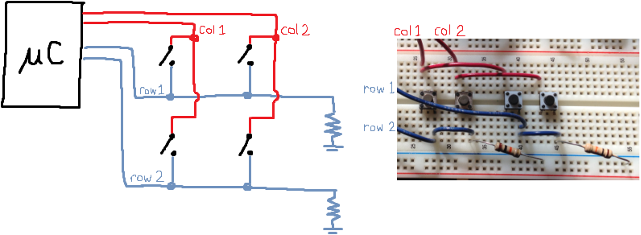
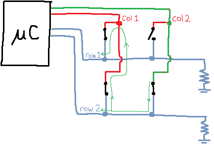
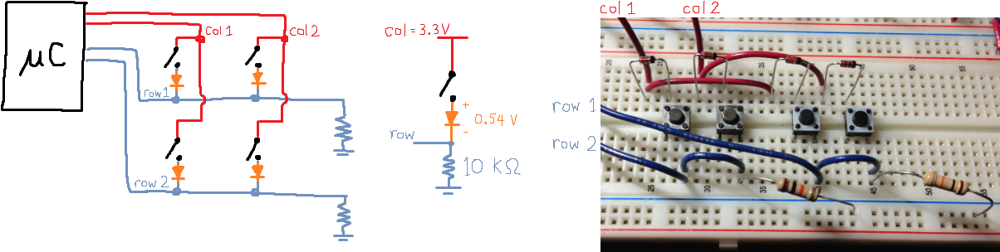

There are many blog posts on how to make a keyboard. I think I get it...
* http://blog.komar.be/how-to-make-a-keyboard-the-matrix/
* https://www.baldengineer.com/arduino-keyboard-matrix-tutorial.html
* Some like to re-explain electrical theory. Some try to avoid discussing any theory. It's annoying...

### Keyboard matrix
Keyboard keys are wired in a matrix because fewer pins are needed to interface to a matrix. It looks very similar to methods used in LED matrices.

Here's a re-explanation (with shitty schematics) for my sake. (The blog posts go over this with better pictures.)

#### Time-division multiplexing
Take turns turning on the columns. Suppose only `col1` is `HIGH`. Then if a switch in `col1` is pressed, the corresponding row will go `HIGH`. Otherwise, the row will be drained to `LOW` by the pulldown resistor.

#### Ghosting
If a key is not pressed, it's possible to press other keys so that the row incorrectly goes `HIGH`. In the picture below, we're scanning `col2` and the top-right switch is not pressed. But there is another path from `col2` to `row1`.

The solution is to use diodes to prevent current from flowing "up" from a row. The forward voltage of the diode is about `0.5 V`, so the output is about `3.3 - 0.5 = 2.7 V` which will still be detected as a logic `HIGH` (`V_IH = 2V`).
* https://learn.sparkfun.com/tutorials/logic-levels/all

