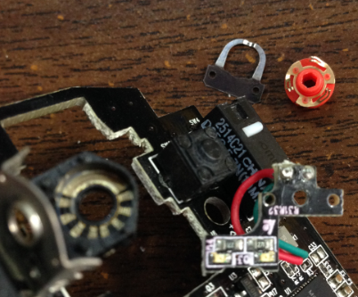
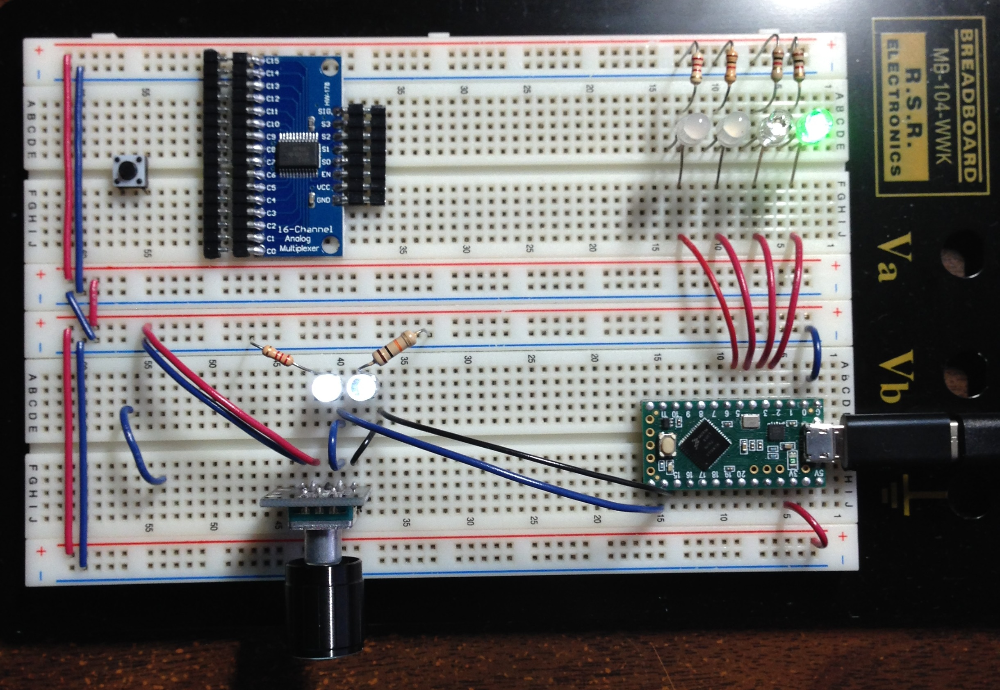

### "KY-040" rotary encoder
* https://www.aliexpress.com/item/32991511891.html?spm=a2g0s.9042311.0.0.51284c4d3Oq38L

### How *this* rotary encoder works
See this [PDF](Rotary%20Encoder.pdf).

I tried to google a teardown but couldn't find much.
* http://practicalusage.com/side-project-understanding-cheap-rotary-encoders/

However, I think the rotary encoder in my mouse's scroll wheel uses the same mechanism.

The rotary encoder has three external pins: `pinA`, `pinB`, and `GND`. Internally, there is a circular track with metal pads; some pads connect to `pinA`, some to `pinB`, or `GND`. There's also a disk with metal leaves/legs and these legs may touch certain pads as the disk rotates. The disk acts as a "switch" that can pull `pinA` and/or `pinB` to `GND` when "closed". When the "switch" is open, the pin is at `V+`. (Both pins have a `10K` pullup resistor so it doesn't short-circuit when pulled down).

** when both pins are pulled to `GND`, the resistors are in parallel (`5K`)

When you turn the knob, there's a *bump* that provides some resistance, but also aligns the disk so that both "switches" are open or closed (i.e. at the same state). In the transition between two "resting spots", one of the pins will change state before the other pin, depending on if the knob was turned clockwise or counterclockwise. Reading the pin states allows us to detect rotation.

** A lot of tutorials describe the two pins as emitting pulses, and are "quadrature" signals (90 degrees out of phase), but it's not the case here. It's just two signals making a `LOW` to `HIGH` (or vice versa) transition, and the delay between edges depends on how slowly you turn the knob. You could also "cancel" it by not fully turning the knob through the bump.

### Breadboard

The program has a counter (int) storing the number of steps turned.

Two LEDs show the state of the two pins of the rotary encoder.
Four LEDs show the lowest four bits of the counter value.
